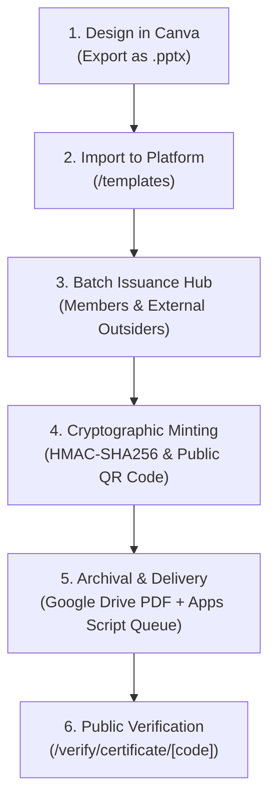

# CSEC-ASTU Certificate Creation, Archival & Email Workflow Guide

## 1. Executive Overview & System Status

The CSEC ASTU certificate verification and issuance infrastructure is built on a **5-stage pipeline**:



### What Is Already Live in Code (Completed)
- [x] **Cryptographic Engine**: HMAC-SHA256 digital signature computation and verification (`backend/app/services/certificates.py`).
- [x] **Universal Recipient Support**: Both internal club members and external participants/outsiders (with student ID or university/org affiliation).
- [x] **Dynamic Variables Engine**: Event-wide and per-recipient variables (e.g., `{{EVENT_NAME}}`, `{{RANK}}`, `{{TRACK}}`) stored as PostgreSQL JSON attributes without schema changes.
- [x] **Template Marketplace & Importer**: Notion-inspired gallery at `/templates` with Canva `.pptx` upload and local persistence.
- [x] **Issuance Wizard (`IssueCertificatesDialog`)**: Multi-tab selector for Club Members, Outsiders (form + CSV paste), and live cryptographic minting.
- [x] **Public Verification Portal**: Real-time authenticity badge at `/verify/certificate/[code]` with QR verification.

### What Connects the Google Cloud & Email Loop
To automate the final delivery stage (uploading PDFs to Google Drive and emailing recipients), the backend communicates with:
1. **Google Drive API** (via Google Service Account) to store generated certificate PDFs.
2. **Google Apps Script Webhook** (or SMTP) to send branded delivery emails from official `@csec.astu.edu.et` or Google Workspace accounts.

---

## 2. Required Environment Variables (`.env`)

Add the following environment variables to your `backend/.env` file:

```dotenv
# ==============================================================================
# CSEC ASTU CERTIFICATE & CLOUD DELIVERY CONFIGURATION
# ==============================================================================

# 1. Base URL for QR codes and verification links
FRONTEND_URL="https://csec.astu.edu.et" # or http://localhost:3000 for local testing
JWT_SECRET_KEY="your-secure-cryptographic-signing-secret"

# 2. Google Drive Archival (Service Account)
# Path to downloaded service account JSON file, OR raw JSON string
GOOGLE_SERVICE_ACCOUNT_FILE="secrets/google-service-account.json"
# OR: GOOGLE_SERVICE_ACCOUNT_JSON='{"type": "service_account", ...}'

# Destination Google Drive Folder ID (Create folder in Drive -> copy ID from URL)
# Example: drive.google.com/drive/folders/1aBcDeFgHiJkLmNoPqRsTuVwXyZ
GOOGLE_DRIVE_FOLDER_ID="1aBcDeFgHiJkLmNoPqRsTuVwXyZ"

# 3. Google Apps Script Automated Email Webhook
# URL from your deployed Apps Script Web App (Executes under official club account)
GOOGLE_APPS_SCRIPT_WEBHOOK_URL="https://script.google.com/macros/s/AKfycbx.../exec"
APPS_SCRIPT_SECRET_TOKEN="csec-apps-script-auth-token-2026"

# 4. Optional Direct SMTP (Alternative to Apps Script if using SMTP directly)
SMTP_HOST="smtp.gmail.com"
SMTP_PORT=587
SMTP_USER="contact@csec.astu.edu.et"
SMTP_PASSWORD="your-google-app-password"
SMTP_FROM_NAME="CSEC ASTU Credential Registry"
```

---

## 3. Google Drive Service Account Setup (5 Minutes)

To allow the backend to save generated certificate PDFs into the official CSEC Google Drive:

1. **Open Google Cloud Console**: [console.cloud.google.com](https://console.cloud.google.com).
2. **Create or Select Project**: e.g., `csec-astu-platform`.
3. **Enable APIs**:
   - Go to **APIs & Services** > **Library**.
   - Search for **Google Drive API** and click **Enable**.
4. **Create Service Account**:
   - Go to **IAM & Admin** > **Service Accounts** > **Create Service Account**.
   - Name: `csec-drive-bot`.
   - Role: `Editor` or `Storage Object Admin`.
   - Click **Done**.
5. **Create & Download JSON Key**:
   - Click on the created service account > **Keys** > **Add Key** > **Create new key** (JSON).
   - Save the file in `backend/secrets/google-service-account.json` (ensure `secrets/` is in `.gitignore`).
6. **Share the Drive Folder**:
   - Create a folder in Google Drive named: `CSEC_Issued_Certificates_2026`.
   - Right-click the folder > **Share**.
   - Paste the service account email (e.g., `csec-drive-bot@csec-astu-platform.iam.gserviceaccount.com`).
   - Set permission to **Editor**.
   - Copy the Folder ID from the URL (`folders/<FOLDER_ID>`) and set `GOOGLE_DRIVE_FOLDER_ID` in `.env`.

---

## 4. Google Apps Script Email Queue (Ready-to-Deploy Code)

Google Apps Script runs for free on Google Workspace/Gmail and can dispatch customized emails with attachments and Drive links directly from the club's email address.

### Step-by-Step Deployment:
1. Open [script.google.com](https://script.google.com) logged into the official CSEC Google account.
2. Click **New Project** and name it `CSEC_Certificate_Dispatcher`.
3. Replace all contents of `Code.gs` with the script below:

```javascript
/**
 * CSEC ASTU Certificate Delivery Webhook
 * Accepts batch delivery requests from the CSEC platform and sends personalized emails.
 */

const AUTH_SECRET = "csec-apps-script-auth-token-2026"; // Must match APPS_SCRIPT_SECRET_TOKEN in .env

function doPost(e) {
  try {
    const requestData = JSON.parse(e.postData.contents);

    // 1. Verify Secret Token
    if (requestData.secret !== AUTH_SECRET) {
      return ContentService.createTextOutput(JSON.stringify({ status: "unauthorized" }))
        .setMimeType(ContentService.MimeType.JSON);
    }

    const batch = requestData.certificates || [];
    let sentCount = 0;
    let failedCount = 0;
    const results = [];

    // 2. Loop through recipients and send emails
    for (let i = 0; i < batch.length; i++) {
      const item = batch[i];
      if (!item.recipient_email) {
        continue;
      }

      try {
        const emailHtml = buildEmailHtml(item);

        GmailApp.sendEmail(item.recipient_email, `Your Official Certificate: ${item.title} — CSEC ASTU`, "", {
          htmlBody: emailHtml,
          name: "CSEC ASTU Credential Registry",
          replyTo: "contact@csec.astu.edu.et"
        });

        sentCount++;
        results.push({ cert_code: item.cert_code, status: "sent" });
      } catch (err) {
        failedCount++;
        results.push({ cert_code: item.cert_code, status: "failed", error: err.message });
      }
    }

    return ContentService.createTextOutput(JSON.stringify({
      status: "success",
      total: batch.length,
      sent: sentCount,
      failed: failedCount,
      details: results
    })).setMimeType(ContentService.MimeType.JSON);

  } catch (error) {
    return ContentService.createTextOutput(JSON.stringify({
      status: "error",
      message: error.message
    })).setMimeType(ContentService.MimeType.JSON);
  }
}

/**
 * Branded Responsive HTML Email Template
 */
function buildEmailHtml(data) {
  const verifyUrl = data.verify_url || `https://csec.astu.edu.et/verify/certificate/${data.cert_code}`;
  const driveLink = data.drive_view_link ? `<a href="${data.drive_view_link}" style="display:inline-block;padding:10px 20px;background-color:#7c3aed;color:#ffffff;text-decoration:none;border-radius:8px;font-weight:bold;margin-right:10px;">Download PDF Certificate</a>` : "";

  return `
    <div style="font-family:'Segoe UI',Roboto,Helvetica,Arial,sans-serif;max-width:600px;margin:0 auto;background-color:#0f0f13;color:#f4f4f5;padding:32px;border-radius:16px;border:1px solid #27272a;">
      <div style="border-bottom:1px solid #27272a;padding-bottom:20px;margin-bottom:24px;">
        <h2 style="color:#ffffff;margin:0;font-size:20px;">CSEC ASTU</h2>
        <p style="color:#a1a1aa;margin:4px 0 0 0;font-size:12px;text-transform:uppercase;letter-spacing:1px;">Official Credential Registry</p>
      </div>

      <p style="font-size:16px;color:#ffffff;margin-bottom:8px;">Dear <strong>${data.recipient_name}</strong>,</p>
      
      <p style="font-size:14px;color:#d4d4d8;line-height:1.6;">
        Congratulations! You have been officially awarded the following credential by the <strong>Computer Science and Engineering Club (CSEC)</strong> at Adama Science and Technology University:
      </p>

      <div style="background-color:#18181b;padding:20px;border-radius:12px;border:1px solid #3f3f46;margin:24px 0;">
        <h3 style="color:#fbbf24;margin:0 0 6px 0;font-size:18px;">${data.title}</h3>
        <p style="color:#a1a1aa;font-size:13px;margin:0 0 12px 0;">${data.description || "In recognition of outstanding achievement and dedication."}</p>
        <div style="font-family:monospace;font-size:12px;color:#e4e4e7;background:#09090b;padding:8px 12px;border-radius:6px;display:inline-block;">
          Credential Code: <strong>${data.cert_code}</strong>
        </div>
      </div>

      <p style="font-size:13px;color:#a1a1aa;line-height:1.5;">
        Your certificate has been cryptographically signed and stored in the permanent university club registry. Anyone can scan the QR code on your certificate or visit the link below to verify its authenticity:
      </p>

      <div style="margin:28px 0;">
        ${driveLink}
        <a href="${verifyUrl}" style="display:inline-block;padding:10px 20px;background-color:#27272a;color:#ffffff;text-decoration:none;border-radius:8px;font-weight:bold;border:1px solid #3f3f46;">Verify Publicly</a>
      </div>

      <div style="border-top:1px solid #27272a;padding-top:20px;margin-top:32px;font-size:11px;color:#71717a;text-align:center;">
        Computer Science and Engineering Club · Adama Science & Technology University (ASTU)<br/>
        This is an automated system dispatch.
      </div>
    </div>
  `;
}
```

4. **Deploy as Web App**:
   - Click **Deploy** > **New deployment**.
   - Select type: **Web app**.
   - Execute as: **Me** (`your-account@csec.astu.edu.et`).
   - Who has access: **Anyone** (the secret token protects the endpoint).
   - Click **Deploy** and authorize permissions.
   - Copy the Web App URL and place it in `GOOGLE_APPS_SCRIPT_WEBHOOK_URL` in `.env`.

---

## 5. Backend Python Automated Dispatch Script

The backend already has the cryptographic batch engine in [`app/services/certificates.py`](file:///d:/Full-Stack_Projects/csec-astu-platform/backend/app/services/certificates.py). 

To trigger the Google Apps Script email dispatch after issuing, the backend includes an automated dispatcher function:

```python
import httpx
from app.config import Settings
from app.models import Certificate

async def dispatch_certificates_email_queue(
    certs: list[Certificate],
    settings: Settings,
) -> dict:
    """Send batch certificates to Google Apps Script webhook for email dispatch."""
    if not settings.google_apps_script_webhook_url:
        return {"status": "skipped", "reason": "Webhook URL not configured"}

    payload = {
        "secret": settings.apps_script_secret_token,
        "certificates": [
            {
                "cert_code": c.cert_code,
                "recipient_name": c.recipient_name,
                "recipient_email": c.recipient_email,
                "title": c.title,
                "description": c.description,
                "drive_view_link": c.drive_view_link,
                "verify_url": f"{settings.frontend_url}/verify/certificate/{c.cert_code}",
            }
            for c in certs
            if c.recipient_email
        ],
    }

    if not payload["certificates"]:
        return {"status": "skipped", "reason": "No recipients with email addresses"}

    async with httpx.AsyncClient(timeout=30.0) as client:
        res = await client.post(settings.google_apps_script_webhook_url, json=payload)
        return res.json()
```

---

## 6. End-to-End Operator Workflow (On Event Day)

Here is how an officer or Social Media division member issues certificates:

1. **Design**:
   - Social Media division creates the certificate in Canva with placeholders (`{{STUDENT_NAME}}`, `{{CERT_CODE}}`, `{{QR_CODE}}`, `{{RANK}}`).
   - Download as `.pptx`.
2. **Import**:
   - Go to `http://localhost:3000/templates`.
   - Click **Import Canva Template (.pptx)** and upload the file.
3. **Issue**:
   - Click **Issue Certificates**.
   - Select recipients:
     - For internal club members: Pick from the **CSEC Club Members** tab with division filters.
     - For external participants/outsiders: Paste rows in the **External Participants** tab (`Name, Email, University, Rank`).
   - Click **Issue Certificates**.
4. **Automated Execution**:
   - The platform generates HMAC-SHA256 signatures, unique codes, and stores records in PostgreSQL.
   - The webhook dispatches emails to all recipients with direct verification links.
   - Recipient scans QR code or clicks link to view their official credential on `/verify/certificate/[code]`.
